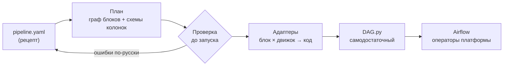
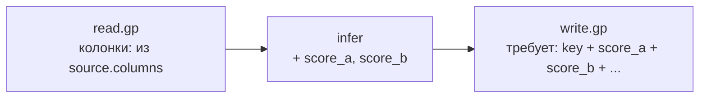
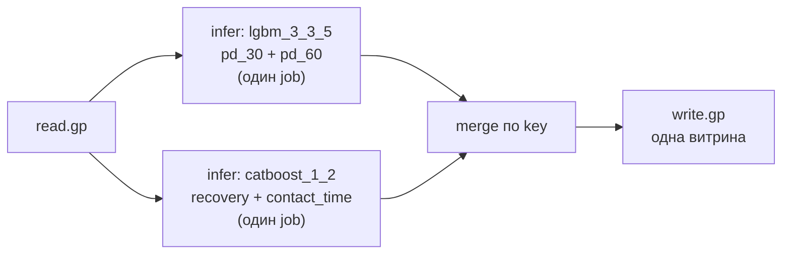
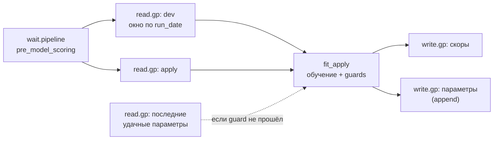
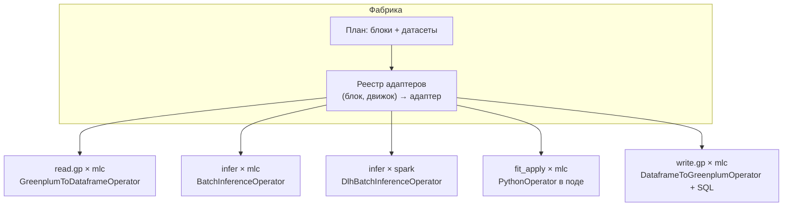
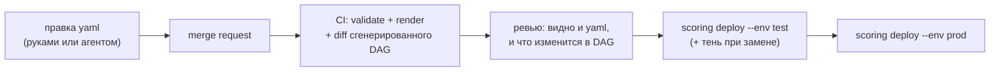

# Фабрика инференса: архитектура scoring-kit 1.0

Статус: проект для обсуждения. Основа — scoring-kit 0.2, который уже прошёл теневой прогон на
боевых данных со скорами, совпавшими 1:1.

Документ написан так, чтобы его можно было отдать агенту как контекст: разделы 6–8 — контракт
конфигурации, раздел 11 — устройство кода, раздел 12 — правила для агентов.

---

## 0. Коротко

**Что строим.** Фабрику DAG'ов: человек описывает процесс скоринга в `pipeline.yaml` (что читать,
какие модели применить, куда писать, когда), фабрика проверяет описание и генерирует готовый
Airflow DAG на операторах платформы. Airflow человеку знать не нужно.

**Главная идея.** Пользователь выбирает **рецепт** (типовой сценарий) и заполняет его поля. Рецепт
разворачивается во внутренний **план** — граф из типовых **блоков** (чтение, инференс, обучение,
слияние, запись). План проверяется целиком, вплоть до колонок, и превращается в код через
**адаптеры** к конкретным операторам. Новый сценарий = новый рецепт из тех же блоков. Новый
оператор платформы = новый адаптер, конфиги не меняются.



**Принципы.**

1. **Конфиг — источник правды, DAG — производный артефакт.** DAG руками не правят.
2. **Рецепты, а не свободный конструктор.** Свободный граф из кубиков — это и есть сложность,
   которую мы убираем. Граф доступен только как расширенный режим.
3. **Ошибка — до запуска.** Всё, что можно проверить без данных (колонки, типы, ключи,
   зависимости), проверяется на `scoring validate` и в CI.
4. **Операторы платформы — заменяемые детали.** Вся привязка к ним живёт в адаптерах.
5. **Один код локально и в проде.** `scoring debug` исполняет те же функции, что поды Airflow.
6. **Безопасный выпуск по умолчанию.** Тень → сверка → переключение → откат паузой.
7. **Каждый DAG получает обвязку бесплатно:** алерты, проверки данных, ретраи, документацию, теги.

---

## 1. Что уже есть (scoring-kit 0.2)

- Рецепт «одна модель»: чтение из Greenplum → `BatchInferenceOperator` → запись (stg + перенос в
  транзакции + гранты + актуализация).
- Контракт фичей (порядок, категориальные, `float32`/`float64`), единое приведение типов во всех
  батчах.
- Проверки: пустая выборка, наличие колонок (включая колонки приёмника), уникальность ключа,
  скор без пропусков и в диапазоне.
- Теневой режим (`--shadow`), SQL сверки, локальный прогон `scoring debug`.

**Факты о платформе, выясненные по исходникам операторов** (на них опирается весь дизайн):

| Факт | Следствие для архитектуры |
|---|---|
| `BatchInferenceOperator` читает вход только `pd.read_csv(chunksize=batch_size)` | между тасками — csv; типы восстанавливаются по контракту |
| Класс предиктора передаётся в под как исходник, подстрока `BasePredictor` вырезается | весь код пода — самодостаточный, без имён модуля |
| Job инференса ограничен 2 часами | большие объёмы — батчи/потоковое чтение или Spark |
| `DataframeToGreenplumOperator(mode="dal")` игнорирует `columns_types` | типы для записи приводит фабрика |
| `GreenplumToDataframeOperator(mode="dal", use_iter=True)` отдаёт поток батчей | чтение больших выборок без загрузки всего в память |
| Колбэки Greenplum-операторов и `PythonOperator` исполняются в подах с `executor_config` | обучение/слияние можно делать в поде нужного размера |
| Свой пакет в общий Airflow не поставить | **генерация кода**, а не фабрика во время парсинга |

---

## 2. Сценарии

| # | Сценарий | Пример | Рецепт |
|---|---|---|---|
| S1 | Одна модель → один скор | бустинг вероятности банкротства | `single_model` |
| S2 | Несколько моделей → несколько скоров → одна витрина | 4 модели, 4 колонки скоров | `multi_model` |
| S3 | Ежедневное переобучение на скользящем окне (dev) и применение к новым данным (apply) | калибровка | `fit_apply` |
| S4 | Цепочки: процесс ждёт результат другого процесса | калибровка поверх скоров базовой модели | любой рецепт + `wait_for.pipelines` |
| S5 | Очень большие объёмы (сотни миллионов строк) | полный пересчёт базы | любой рецепт + `engine: spark` |
| S6 | Нестандартный процесс | всё, что не укладывается в рецепты | `graph` (расширенный режим) |

---

## 3. Почему «рецепты поверх графа блоков»

| Подход | Плюс | Минус |
|---|---|---|
| Свободный конструктор (как старый UI) | гибкость | каждый процесс уникален: трудно читать, ревьюить, поддерживать; ошибки находятся только в рантайме |
| Жёсткий шаблон под каждый сценарий | просто | каждый новый сценарий — копия кода; правка обвязки в N местах |
| **Рецепты → план из блоков** | просто для пользователя, гибко внутри | нужно один раз хорошо спроектировать блоки |

Рецепт — это функция `yaml → план`. Блоки и обвязка общие для всех рецептов. 90% процессов
описываются рецептами в 20–40 строк yaml; оставшиеся 10% — расширенным режимом `graph` из тех же
блоков, без произвольного Python-кода между ними.

---

## 4. Блоки (каталог шагов)

Каждый блок: **входы** (именованные датасеты) → **выход** (датасет с известным списком колонок).

| Блок | Что делает | Движок `mlc` (по умолчанию) | Движок `spark` |
|---|---|---|---|
| `wait.table` | ждёт актуальности таблиц | `GreenplumTablesWaitSensor` / `DLHTablesWaitSensor` | — |
| `wait.pipeline` | ждёт успешной записи другого процесса | сенсор актуальности на его приёмник | — |
| `read.gp` | SQL в Greenplum → датасет; проверки входа | `GreenplumToDataframeOperator` (`use_iter`) | — |
| `read.dlh` | SQL в DLH → датасет | `DLHToDataframeOperator` | таблица DLH как есть |
| `infer` | модели из реестра → колонки скоров | `BatchInferenceOperator` | `DlhBatchInferenceOperator` |
| `fit_apply` | обучить на `dev`, применить к `apply` | `PythonOperator` в поде | `DlhSparkSubmitOperator` |
| `merge` | соединить датасеты по ключу | `PythonOperator` в поде | Spark SQL |
| `check` | проверки качества (DQ) на датасете | встроено в соседние блоки | встроено |
| `write.gp` | stg → перенос в транзакции → гранты → актуализация | `DataframeToGreenplumOperator` + `GreenplumExecuteOperator` | — |
| `write.dlh` | запись в DLH | `WriteDataToDLHOperator` | запись Spark |

Связка «блок × движок → код» — это **адаптер**. Адаптер знает про конкретный оператор, его
параметры и пути `/work/...`. Если платформа заменит оператор, меняется один адаптер.

---

## 5. Датасеты и схемы: проверка колонок до запуска

В 0.2 ошибка «для записи нет колонок» всплыла только в Airflow. В 1.0 каждый блок объявляет, какие
колонки он выдаёт, и фабрика **протягивает схему по графу**:



- `read.gp` объявляет колонки выборки в `source.columns` (или фабрика берёт их из фичей, ключа и
  колонок приёмника — как в 0.2);
- `infer` добавляет колонки скоров (по одной на модель/выход);
- `merge` объединяет схемы по ключу и запрещает конфликты имён;
- `write.gp` проверяет, что все его колонки есть во входе.

Итог: `scoring validate` ловит отсутствующие колонки, перепутанные имена скоров, конфликт имён при
слиянии — до первой публикации.

---

## 6. Формат конфигурации

### 6.1 Общая шапка (одинакова для всех рецептов)

```yaml
pipeline: default_pd_v2            # имя процесса: строчные, цифры, _
recipe: single_model               # single_model | multi_model | fit_apply | graph
owner: i.ivanov
description: Вероятность дефолта на 90+ для стадии 30-60
domain: collection                 # группировка в каталоге и в тегах Airflow
schedule: daily 07:30 msk          # или cron: "30 4 * * *" (UTC)
alerts: team_default               # ссылка на настройку из alerts.yaml
runtime: lgbm_3_3_5                # ссылка на рантайм из runtimes.yaml (образ + зависимости)
```

Вынесенные общие справочники (лежат в репозитории пайплайнов, правятся редко):

```yaml
# runtimes.yaml — именованные окружения моделей: одинаковые версии у всех
lgbm_3_3_5:
  image: <registry>/mlops/uv-lgbm-4.5:latest
  requirements: [numpy==1.26.0, pandas==2.1.1, lightgbm==3.3.5]
catboost_1_2:
  image: <registry>/python/3.10/base:latest
  requirements: [catboost==1.2.5]

# alerts.yaml — куда сообщать
team_default:
  on_failure: [<канал команды>]
  on_retry: false
  on_success: false

# environments.yaml — инстансы и проект для публикации
test: {instance: <тестовый инстанс>, project: <проект>}
prod: {instance: <боевой инстанс>,  project: <проект>}
```

### 6.2 S1: одна модель

```yaml
pipeline: default_pd_v2
recipe: single_model
owner: i.ivanov
schedule: daily 07:30 msk
runtime: lgbm_3_3_5

source:
  gp: vrcl
  wait_for: [mart.collection_features_fresh]
  query: |
    select customer_rk, account_rk, report_dt, f1, f2, f3, segment_cd
    from mart.collection_features_fresh
  key: [customer_rk, account_rk]
  min_rows: 100000

model:
  mrid: team/default_pd/1.4.0
  features: [f1, f2, segment_cd, f3]       # порядок обучения
  cat_features: [segment_cd]
  num_dtype: float32
  output:
    score: proba                           # встроенный предиктор: predict_proba()[:, 1]

sink:
  table: usr_coll.default_pd_v2_fresh
  mode: replace
  columns: [customer_rk, account_rk, report_dt, score]
  types: {customer_rk: bigint, account_rk: bigint, report_dt: date, score: numeric}
```

`predictor.py` не нужен: `output.score: proba` — встроенный предиктор (раздел 7).

### 6.3 S2: несколько моделей → одна витрина

```yaml
pipeline: collection_quartet
recipe: multi_model
owner: i.ivanov
schedule: daily 07:30 msk

source: {...}                              # как в S1; одна выборка на все модели

models:
  - name: pd_30
    mrid: team/pd_30/2.1.0
    runtime: lgbm_3_3_5
    features: [...]
    output: {score_pd_30: proba}
  - name: pd_60
    mrid: team/pd_60/1.0.3
    runtime: lgbm_3_3_5
    features: [...]
    output: {score_pd_60: proba}
  - name: recovery
    mrid: team/recovery_amt/0.9.0
    runtime: catboost_1_2
    features: [...]
    output: {expected_recovery: predict}   # регрессия
    score_range: null                      # без проверки [0, 1]
  - name: contact_time
    mrid: team/contact_time/1.2.0
    runtime: catboost_1_2
    features: [...]
    predictor: contact_time_predictor.py   # нестандартный выход — свой предиктор
    output: {best_hour: custom, best_channel: custom}

execution: auto                            # auto | one_job | per_model

sink:
  table: usr_coll.collection_quartet_fresh
  mode: replace
  columns: [customer_rk, account_rk, report_dt, score_pd_30, score_pd_60, expected_recovery, best_hour, best_channel]
```

Как исполняется:



- `execution: auto` — модели группируются **по рантайму**: модели с одинаковым окружением считаются
  одним job'ом (`BatchInferenceOperator` принимает список `mrid`, данные читаются один раз), разные
  окружения — параллельными job'ами, затем `merge` по ключу.
- `one_job` — всё в одном job'е (требует одинаковый рантайм).
- `per_model` — каждая модель отдельно: изоляция падений, параллельность, удобно при разных объёмах.
- Падение одной модели в `per_model` по умолчанию валит процесс целиком: витрина не пишется
  частично. Опция `on_model_failure: write_partial` — осознанное исключение.

### 6.4 S3: ежедневное переобучение (калибровка)

```yaml
pipeline: pre_model_calibration
recipe: fit_apply
owner: i.ivanov
schedule: daily 09:00 msk
runtime: sklearn_1_3

wait_for:
  pipelines: [pre_model_scoring]           # S4: ждём, пока базовая модель запишет скоры

window:                                    # окно dev на дату запуска run_date
  length_days: 90                          # dev = [run_date - lag - length, run_date - lag)
  lag_days: 180                            # факт созревает 180 дней

dev:
  gp: vrcl
  query: |
    select score, fact_flg, segment_cd
    from usr_coll.pre_model_scores_hist
    where report_dt >= {{ window.start }} and report_dt < {{ window.end }}
  min_rows: 50000

apply:
  gp: vrcl
  query: |
    select customer_rk, account_rk, report_dt, score, segment_cd
    from usr_coll.pre_model_scores_fresh
  key: [customer_rk, account_rk]

fit:
  method: logistic                         # logistic | isotonic | platt_by_segment | custom
  x: score
  y: fact_flg
  by: segment_cd                           # необязательно: свой калибратор на сегмент
  output: {calibrated_score: proba}
  guards:
    min_auc_on_dev: 0.6                    # не даём обучиться на испорченных данных
    max_param_shift: 0.5                   # резкий скачок параметров относительно вчера
    on_fail: use_last_good                 # use_last_good | fail

sinks:
  - table: usr_coll.pre_model_calibrated_fresh
    mode: replace
    columns: [customer_rk, account_rk, report_dt, calibrated_score]
  - table: usr_coll.pre_model_calibrator_params   # история калибраторов: аудит и откат
    from: fit_params
    mode: append
```

Как исполняется:



Ключевые решения:

- **Окно считается от логической даты запуска Airflow (`ds`)**, а не от «сегодня». Перезапуск за
  прошлую дату воспроизводит ровно тот же dev. `{{ window.start }}` и `{{ window.end }}`
  превращаются в макросы Airflow (`macros.ds_add`), запрос — template field оператора.
- **Параметры калибратора пишутся в таблицу истории** (дата, сегмент, коэффициенты, метрики на dev,
  объём dev). Это аудит («какой калибратор применялся 3 сентября») и источник для отката.
- **Guards**: если dev пустой, AUC упал или параметры скакнули, процесс применяет последний
  удачный калибратор из истории и шлёт предупреждение (или падает — `on_fail: fail`).
- Встроенные методы покрывают типовую калибровку; `method: custom` + `calibrator.py` с методами
  `fit(dev) -> params` и `apply(df, params) -> df` — для своей логики. Параметры — словарь,
  поэтому сохраняются в таблицу без pickle.

### 6.5 S4: зависимости между процессами

`wait_for.pipelines: [имя]` — фабрика знает приёмник того процесса и ставит сенсор актуальности
на его таблицу (приёмники и так актуализируются после записи). Каталог (раздел 10) строит граф
зависимостей всех процессов и ловит циклы.

### 6.6 S5: большие объёмы

`engine: spark` на уровне процесса или модели переключает адаптеры на DLH/Spark. Конфиг остальных
полей не меняется. Правило выбора по умолчанию: до ~30–50 млн строк — `mlc` с потоковым чтением,
выше — `spark`. Это решение принимается после выяснения, какие процессы реально такие (вопросы,
раздел 14).

### 6.7 S6: расширенный режим `graph`

```yaml
recipe: graph
steps:
  base:      {block: read.gp, query: ..., key: [...]}
  extra:     {block: read.gp, query: ..., key: [...]}
  joined:    {block: merge, inputs: [base, extra], on: [customer_rk]}
  scored:    {block: infer, input: joined, models: [...]}
  out:       {block: write.gp, input: scored, table: ..., columns: [...]}
```

Те же блоки, те же проверки схем. Произвольный Python между блоками не допускается; если без него
никак — блок `transform` с функцией из файла, с объявленными входными и выходными колонками.

---

## 7. Предикторы без кода

Большинству бустинговых моделей не нужен `predictor.py`. Встроенные выходы:

| `output` | Что вызывает | Для чего |
|---|---|---|
| `proba` | `predict_proba(X)[:, 1]` | бинарная классификация |
| `proba:<k>` | `predict_proba(X)[:, k]` | класс `k` мультикласса |
| `predict` | `predict(X)` | регрессия, метки |
| `raw` | `predict(X, raw_score=True)` (LightGBM) / `prediction_type="RawFormulaVal"` (CatBoost) | логиты |
| `custom` | ваш `predictor.py` | всё остальное |

Загрузка модели — по формату артефакта в реестре (`joblib`, `pickle`, `cloudpickle`, нативные
форматы LightGBM/CatBoost). Свой `predictor.py` остаётся для нестандартных случаев, правила те же,
что в 0.2.

---

## 8. Движки и адаптеры



Контракт адаптера:

```python
class Adapter(Protocol):
    block: str            # "infer"
    engine: str           # "mlc"

    def validate(self, step, plan) -> list[str]: ...        # ограничения этого оператора
    def render(self, step, plan) -> RenderedTask: ...        # код таска + входы/выходы /work/...
    def debug(self, step, inputs) -> DataFrame: ...          # локальное исполнение того же кода
```

Ограничения конкретного оператора (csv-вход, лимит 2 часа, игнорирование `columns_types`) живут в
адаптере и проверяются в `validate`: пользователь получает ошибку на этапе сборки, а не в логах.

---

## 9. Обвязка: что получает каждый DAG

| Что | Как |
|---|---|
| Алерты | `on_failure_callback` (и по желанию `on_retry`/`on_success`) в канал из `alerts.yaml`; текст: процесс, таск, владелец, ссылка на лог и на yaml |
| Проверки данных (DQ) | вход: пустота, ключ, колонки, доля пропусков в фичах (порог), объём относительно вчера (±N%); выход: скоры без пропусков, диапазон, доля нулевых, распределение |
| Ретраи | на всё, кроме сенсоров; таймауты на каждый таск |
| Атомарная запись | stg → `truncate + insert` в транзакции; `append` — идемпотентно по `run_id` (повторный запуск не дублирует строки) |
| История скоров | опциональный второй приёмник `*_hist` с `scored_at`, `model_mrid`, `run_id` |
| Документация DAG | `doc_md`: описание, владелец, модели и версии, источники и приёмники, ссылка на yaml в GitLab, runbook |
| Теги Airflow | `domain`, `recipe`, `owner`, `scoring-kit` — фильтры в UI Airflow |
| Тень | `--shadow`: свой `dag_id`, таблицы `_shadow`, без актуализации |
| Метаданные запусков | таблица `scoring_runs`: процесс, дата, строк на входе/выходе, длительность, версии моделей, статус — один SQL для мониторинга всех процессов |

---

## 10. Навигация и изменения

### Структура репозитория процессов

```
scoring-pipelines/
  runtimes.yaml
  alerts.yaml
  environments.yaml
  pipelines/
    collection/
      default_pd_v2/
        pipeline.yaml
      collection_quartet/
        pipeline.yaml
        contact_time_predictor.py
      pre_model_calibration/
        pipeline.yaml
    recovery/
      ...
  CATALOG.md                 # генерируется: не править
```

### Соглашения

- `dag_id = <domain>__<pipeline>` (например, `collection__default_pd_v2`): в UI Airflow процессы
  отдела стоят рядом и сортируются по доменам.
- Имена приёмников: `<schema>.<pipeline>[_<suffix>]_fresh` / `_hist`.
- Одна папка — один процесс — один DAG.

### Каталог

`scoring catalog` генерирует `CATALOG.md` (и при желании таблицу в Greenplum): все процессы,
владельцы, расписания, модели с версиями, источники, приёмники, зависимости (граф mermaid).
Вопросы «какие процессы используют модель X», «кто пишет в витрину Y», «что сломается, если
таблица Z опоздает» — одна страница.

### Как вносятся изменения



- CI прикладывает к MR **diff сгенерированного DAG'а**: ревьюер видит не только «поменяли версию
  модели», но и что это значит для тасков.
- `scoring deploy --env test|prod` оборачивает `mlc airflow publish` с `--prefixes`, берёт инстанс
  из `environments.yaml`, сначала показывает `--check`.
- Откат: предыдущий коммит → `deploy`. Для замены процесса — старый DAG на паузе неделю.

---

## 11. Устройство кода фабрики

```
scoring_kit/
  spec/          # pydantic-схемы: шапка, рецепты, справочники; JSON Schema для IDE и агентов
  recipes/       # single_model.py, multi_model.py, fit_apply.py, graph.py: yaml → план
  plan/          # Plan, Step, Dataset; протягивание схем; проверки графа (циклы, колонки, ключи)
  adapters/      # (блок, движок) → код таска; реестр адаптеров
  runtime/       # самодостаточные функции для подов: проверки, приведение типов, merge, калибраторы,
                 # встроенные предикторы (вставляются в DAG исходным кодом)
  render/        # план → DAG.py: шапка, обвязка (алерты, doc_md, теги), таски, связи
  catalog/       # CATALOG.md, граф зависимостей
  deploy/        # обёртка над mlc
  debug/         # локальный прогон плана на заглушках Airflow
  cli.py
```

Границы слоёв:

- рецепт **не знает** операторов — только блоки;
- адаптер **не знает** рецептов — только блок и его параметры;
- `runtime/` **не импортирует ничего** из пакета: каждая функция самодостаточна (проверяется тестом
  на свободные имена, как в 0.2).

Тесты:

| Уровень | Что проверяет |
|---|---|
| Unit | функции `runtime/`, схемы, рецепты → план |
| Golden | сгенерированный DAG для эталонных конфигов сравнивается с сохранённым файлом: любое изменение генератора видно в diff |
| Граф | DAG исполняется на заглушках Airflow: таски, связи, пути `/work/...` |
| Паритет | скоры через фабрику совпадают с эталонным кодом бит в бит (как в 0.2) |
| Совместимость | CI на версиях из подов (pandas 2.1.4) и на свежих |

Совместимость конфигов: поле `schema_version` в yaml. Старые конфиги 0.2 читаются как
`recipe: single_model` (переводчик в `spec/`), `scoring migrate` переписывает их в новый формат.

---

## 12. Работа с агентами

- `scoring schema > pipeline.schema.json` — JSON Schema конфига. В VS Code (расширение YAML)
  даёт автодополнение и подсветку ошибок прямо при наборе; агенту — точный контракт вместо догадок.
- `scoring explain pipelines/x` — человеческое описание того, что сделает DAG (таски, таблицы,
  расписание в МСК). Удобно проверять результат работы агента.
- Шаблоны промптов в `docs/agents/`: «заведи модель по описанию», «добавь модель в multi_model»,
  «переведи процесс из старого инструмента по коду DAG'а».

Что агенту **можно** править: `pipelines/**`, справочники. Что **нельзя** без человека: код
`scoring_kit/` (ядро). Страховка — CI: невалидный конфиг не пройдёт `validate`, а diff
сгенерированного DAG'а покажет неожиданные изменения.

---

## 13. Дорожная карта

| Этап | Что | Результат |
|---|---|---|
| 1. Ядро 1.0 | план + блоки + адаптеры `mlc`; рецепт `single_model` на новом ядре; golden-тесты; перевод конфигов 0.2 | текущие процессы работают на 1.0 без изменений скоров |
| 2. Несколько моделей | `multi_model`, группировка по рантаймам, `merge`, встроенные предикторы, `runtimes.yaml` | процесс с 4 моделями в одной витрине |
| 3. Переобучение | `fit_apply`, окно по `ds`, история параметров, guards, `use_last_good`; `wait_for.pipelines` | калибровка на фабрике |
| 4. Эксплуатация | алерты, `scoring_runs`, DQ-пороги, `doc_md`, каталог, `deploy`, diff в CI | процессы наблюдаемы, изменения безопасны |
| 5. Миграция | перевод остальных процессов, теневые прогоны, отключение старого инструмента | старый инструмент не нужен |
| 6. Масштаб (по необходимости) | `engine: spark`, `read.dlh`/`write.dlh` | тяжёлые процессы |

Каждый этап заканчивается работающим процессом в тени на боевых данных: нет этапа «только
инфраструктура».

---

## 14. Решения и вопросы

Влияют на дизайн и нужны до этапа 2–3:

1. **Калибровка.** Что именно обучается (логистическая регрессия по скору, изотоническая, по
   сегментам)? Как определяется dev: окно по дате скоринга с созревшим фактом? Калибруются скоры
   нашей же базовой модели (тогда это S4)? Пример текущего кода калибровки сильно поможет.
2. **Четыре модели.** Одна выборка на все модели или разные запросы? Одинаковые библиотеки и
   версии? Есть ли постобработка, объединяющая скоры (например, выбор по сегменту)?
3. **Большие объёмы.** Какие процессы больше 30–50 млн строк? Где лежат их источники (Greenplum
   или DLH)? Если таких нет, Spark откладываем.
4. **Алерты.** Есть ли на инстансе готовый способ уведомлений (провайдер, вебхук мессенджера,
   `notifications` в конфиге запуска)? Разведчик операторов (`tools/introspect_dag.py`, таск
   `operators_catalog`) покажет, что установлено.
5. **Деплой из CI.** Можно ли запускать `mlc` в CI с сервисной учётной записью, или публикация
   остаётся ручной?
6. **Владение.** Кто поддерживает ядро (минимум двое), кто ревьюит конфиги.
